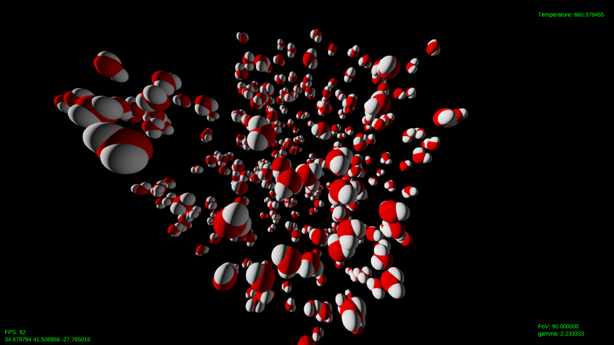

# 3D Molecular dynamics


<!---
Old URL:
https://render.githubusercontent.com/render/math?math=\displaystyle+

Plus (+) = %2B
Space = %20
Comma (,) = %2C
--->
This is an interactive program for molecular dynamics using classical force fields. A force field is defined from the following potential (using CHARMM convention):
<div align="center">

</div>
<div align="center">

</div>
<div align="center">

</div>

The first term describes the bond potential, modeled as an elastic potential between bonded atoms (with elastic constant ), the second term is the angle potential, the third term is the Urey-Bradley potential, acting between 1-3 atoms, the fourth and fifth terms describe the dihedral (proper and improper) angles potentials and the last two terms correspond to non-bonded potentials (Lennard-Jones and electrostatic respectively).

References:
* M. P. Allen, D. J. Tildesley, *Computer Simulation of Liquids*, Oxford University Press, 2017
* P. Spijker, B. Markvoort, P. Hilbers, *Parallel Utility for Modeling of Molecular Aggregation*, Biomodeling and bioinformatics, Eindhoven University of Technology, 2007

#### Table of contents

* [The code](#the-code)
  * [Dependencies](#dependencies)
  * [Compilation](#compilation)
  * [Basic usage](#basic-usage)
* [Molecular dynamics techniques](#molecular-dynamics-techniques)
  * [Ewald summation](#ewald-summation)
  * [PPPM method](#pppm-method)
  * [Nosé-Hoover thermostat](#nosé-hoover-thermostat)
  * [Martyna-Tobias-Klein equations](#martyna-tobias-klein-equations)
  * [Integration schemes](#integration-schemes)


## The code
The code makes use of C++ templates and concepts (thus it requires C++20) and is organised in many header files, that can be included from one or more compilation units. The repository is structured in the following way:
* `examples`: directory containing example code using the library.
* `gui`: directory containing the management of the GUI (Graphical User Interface).
  * `shaders`: directory which contains shaders for the rendering of impostors (for fast rendering of spheres), post-processing filters (fast approximate anti-aliasing, blue noise dithering) and text.
  * `controls.hpp`: includes a function to manage keyboard and mouse controls.
  * `font.hpp`: class for drawing text on the window.
  * `graphics.hpp`: class that manages the graphics.
  * `shader.hpp`: some functions to load shaders from file.
  * `stb_image.h`: a single-header file, public domain library for loading images (taken from [here](https://github.com/nothings/stb/blob/master/stb_image.h)).
* `math`: directory which contains helper functions and FFT implementation.
  * `dft.hpp`: contains the `dft` class which implements a simple radix-2 FFT algorithm for both real and complex inputs, and also multidimensional variants.
  * `helper.hpp`: some math helper functions.
* `physics`: directory containing the part of code relevant to the resolution of the physical/numerical problem.
  * `direct.hpp`: direct summation algorithm. It can be used for non-periodic systems.
  * `energy_minimizer.hpp`: energy minimization algorithm. It includes FIRE algorithm.
  * `ewald.hpp`: Ewald summation algorithm (for periodic systems).
  * `integrator`: directory containing classes and concepts for integration of (hamiltonian and not) dynamical systems.
    * `composition_scheme.hpp`: composition scheme integrators.
    * `integrator.hpp`: leapfrog and other integrators.
    * `integrator_base.hpp`: base class and some concepts for integrators.
    * `runge_kutta.hpp`: explicit Runge-Kutta methods.
  * `molecule.hpp`: classes, methods and other utilites for managing molecular systems (dihedral potential part should be added for molecules with more than three atoms).
  * `physical_system.hpp`: base abstract class and some concepts for a physical system to simulate.
  * `physics.hpp`: a header file that includes everything from the `physics` directory.
  * `pppm.hpp`: PPPM (particle-particle, particle-mesh) method for fast calculation of long-range forces for periodic systems.
  * `tensor.hpp`: classes, aliases and data structures for vectors, matrices and tensors with some helper functions.
* `tests`: directory containing tests for functions, methods and classes. The internal structure of this directory mirrors the one of the header files.
* `utils`: directory containing some utilities used in this project.
  * `parallel_sort.hpp`: multi-threaded parallel sorting algorithm based on `std::sort`, `std::inplace_merge` and `utils::thread_pool`.
  * `thread_pool.hpp`: a simple multi-queue thread pool based on `std::jthread`. It reuses threads for many tasks instead of creating and destroying them continuously and thus avoids some overhead.

### Dependencies

The graphics part has some dependencies on public libraries that enable the usage of modern OpenGL (Open Graphics Library):
* [GLFW 3](https://www.glfw.org/) (Graphics Library Framework 3): an open source, multi-platform API for creating windows, contexts and managing input and events.
* [GLEW](http://glew.sourceforge.net/) (OpenGL Extension Wrangler): a cross-platform library that includes core and extended OpenGL functionalities.
* [FreeType](https://freetype.org/): an OpenGL library to render fonts (used in `font.hpp`).

These dependencies are required only for these header files:
* `gui/graphics.hpp`
* `gui/font.hpp` (included in `gui/graphics.hpp`)
* `gui/shader.hpp` (included in `gui/graphics.hpp`)
* `gui/controls.hpp` (included in `gui/graphics.hpp`)

To install all dependencies at once on Ubuntu, you can run the shell script `dependencies_ubuntu.sh`.

### Compilation

To compile the program, simply do (on MinGW):

    g++ <ins> -o <out> -std=c++20 -I <includes> -L <libs> -lopengl32 -lglu32 -lglew32.dll -lglfw3dll -lfreetype -Wall -Wextra -pedantic -Ofast

On Linux GCC:

    g++ <ins> -o <out> -std=c++20 -I <includes> -L <libs> -lGL -lGLU -lGLEW -lglfw -lfreetype -Wall -Wextra -pedantic -Ofast

where `<includes>` and `<libs>` are the paths for installed libraries header files and static library files (if required), while `<ins>` and `<out>` are the compilation units names and the output executable name respectively. If GCC is used for compilation, version 10.4+ is required for full C++20 support. Running the graphical part of the program requires OpenGL 3.3+.

### Basic usage

To create a molecular system use the following:
```c++
#include "physics/physics.hpp"

int main()
{
    physics::molecular_system my_system;
    // ...

    return 0;
}
```
To add a molecule to the system, use the method `add_molecule`:
```c++
    my_system.add_molecule(molecule);
```
Currently available molecules are:

* `physics::water_tip3p<T>`: Water molecule, using a flexible TIP3P model with O–H and H–H Lennard-Jones parameters
* `physics::water_tip3p_lr<T>`: Water molecule, using a flexible TIP3P model optimized for long-range interactions
* `physics::water_fba_eps<T>`: Water molecule, using the FBA/&epsilon; model
* `physics::sodium_ion<T>`: Sodium ion
* `physics::chloride_ion<T>`: Chloride ion
* `physics::caesium_ion<T>`: Caesium ion

where `T` is a scalar type. If not specified, `double` is assumed.

To set the coordinates of the molecule:
```c++
    my_system.add_molecule(physics::water_tip3p<>, {1, 2, 3});
```
where the coordinates are given in angstrom. It is also possible to create a primitive cubic lattice:
```c++
    my_system.primitive_cubic_lattice(5, 3, physics::water_tip3p<>);
```
where `5` is the number of molecules along one dimension, and `3` is the lattice constant. See documentation in file `physics/molecule.hpp` for more details.

It is possible to set the algorithm used for the summation of long-range forces and the floating point type used for internal calculations by specifying the template arguments of the `physics::molecular_system` class:
```c++
    physics::molecular_system<long double, physics::ewald> my_system;
```
By default, the floating point type is `double` (64-bit floating point) and the summation algorithm is `physics::pppm`. Currently available summation algorithms are:

* `physics::ewald`: Ewald summation, O(N^2) complexity, more accurate
* `physics::pppm`: Particle-particle, particle-mesh method, O(N log N) complexity, faster, speed and accuracy depend on parameters

To integrate the equations of motion it is needed to declare a numerical integrator object, and then call `step` or `simulate` method:
```c++
    using namespace physics::literals; // for _fs

    physics::leapfrog my_integ(my_system);

    my_integ.step(1_fs); // advance simulation by one step
    my_integ.simulate(1_fs, 10000); // advance simulation by 10000 steps
```
The literal suffix `_fs` is needed to convert the timestep given in femtoseconds into AKMA units, which are used internally in the `physics::molecular_system` class. Note that `my_system` object is taken by reference, so it shall not be destroyed before calling `simulate`. Some currently available numerical integrators are:

* `physics::leapfrog`: Leapfrog method (2nd order, 1 stage)
* `physics::multi_timestep_leapfrog`: Multi-timestep leapfrog method (2nd order, 1 stage for long-range forces)
* `physics::stochastic_leapfrog`: Stochastic "leapfrog" method (1 stage): integrates Langevin equation
* `physics::isokinetic_leapfrog`: Isokinetic "leapfrog" method (2nd order, 1 stage)
* `physics::nose_hoover`: Nosé-Hoover thermostats chain integrator (2nd order, 1 stage): it approximates a canonical (NVT) ensemble
* `physics::mtk`: Martyna-Tobias-Klein equations integrator (2nd order, 1 stage): it approximates an isothermal-isobaric (NPT) ensemble
* `physics::vefrl`: Velocity-extended Forest-Ruth-like method (4th order, 4 stages)
* Composition schemes (they are structure-preserving, and can be used to construct higher-order, also symplectic, methods starting from 2nd order ones):
  * `physics::forest_ruth`: Forest-Ruth method (4th order, 3 stages)
  * `physics::yoshida6`: Yoshida method (6th order, 8 stages)
  * `physics::suzuki8`: Suzuki method (8th order, 15 stages)
  * `physics::kahan_li10a`: Kahan-Li method (10th order, 31 stages)
* Explicit Runge-Kutta schemes:
  * `physics::ralston4`: Ralston method (4th order, 4 stages)
  * `physics::butcher6`: Butcher method (6th order, 7 stages)
  * `physics::verner8`: Verner method (8th order, 11 stages)

The suggested value for the time step is `1_fs`. This value is more or less the same order of magnitude of the vibration period of O–H bonds. Greater time steps could be used with `physics::multi_timestep_leapfrog` integrator or for systems with smaller frequencies.

To create a window, simply do:
```c++
#include "graphics.hpp"

int main()
{
    graphics my_window;
    // ...

    return 0;
}
```
If we want to simulate the system and draw the configuration at each step until the window is closed, we can write:
```c++
    while (!my_window.should_close())
    {
        my_integ.step(1_fs);
        my_window.draw(my_system);
    }
```
To calculate thermodynamic quantities as averages of the respective instantaneous quantities, we need a `physics::thermodynamic_statistics` object, which wraps any integrator object. We can then draw custom text on screen using string streams:
```c++
#include <sstream> // for std::stringstream
// ...

int main()
{
    // ...
    physics::leapfrog integ(my_system);
    physics::thermodynamic_statistics my_stat_integ(my_integ);

    while (!my_window.should_close())
    {
        my_integ.step(1_fs);
        std::stringstream my_text;
        my_text << "pressure mean: " << my_stat_integ.pressure_mean();
        my_window.draw(my_system, my_text.str());
    }
}
```
For some complete examples, see the `examples` directory in this repository.
<!--- __________________________________________________________ --->

## Molecular dynamics techniques

### Ewald summation

In a cubic periodic system of side , the electrostatic potential is given by:

<div align="center">

</div>

where the prime symbol means that the  term must be excluded for , and . As it is not practical to calculate all the contributions directly, it is more convenient to calculate the long-range part in Fourier space, leading to a formula which converges much faster than the previous equation. To do so, the Green's function must be separated in the following way:

<div align="center">

</div>

where  is sometimes referred to as the splitting function, which separates the near-range contribution from the long-range one. Choosing  to be the complementary error function, one obtains the classical Ewald summation, whose terms are given by:

<div align="center">

</div>
<div align="center">

</div>
<div align="center">

</div>
<div align="center">

</div>
<div align="center">

</div>

where  is the contribution from real space (short-range),  is the contribution from the reciprocal space (long-range),  is the self-energy correction and  is the dipole correction. The Fourier transform of the charge density  is defined as:

<div align="center">

</div>

The -vectors are given by , while  is the relative dielectric constant of the material surrounding the system (equal to 1 for vacuum) and  is a free parameter, known as the Ewald parameter.

References:
* P. Ewald, *Die Berechnung optischer und elektrostatischer Gitterpotentiale*, Annalen der Physik, 369, pp. 253-287, 1921

### PPPM method

The particle-particle, particle-mesh (PPPM, or P<sup>3</sup>M) method can be applied to speed up the calculation of the reciprocal space term of Ewald summation thanks to fast Fourier transform (FFT) algorithms. Since FFT is based on discrete Fourier transforms (DFT), it requires sample points to be equally spaced, so a necessary preparatory step is to interpolate the charges onto a 3-dimensional lattice (called mesh) with spacing . The charge of a single mesh point  is given by:

<div align="center">

</div>

where  and  is the charge assignment function, which is chosen so that the sum behaves as a convolution with a small window (so that the cost of the computation of  is ). Its Fourier transform can be written as a DFT:

<div align="center">

</div>

The reciprical space term of the potential is then given by:

<div align="center">

</div>

where  is the optimal influence function, known also as the lattice Green's function:

<div align="center">

</div>

where , while  is the Fourier transform of the differential operator and  is the Fourier transform of the true reference force:

<div align="center">

</div>

Note that the influence function does not depend on the particles positions and thus can be calculated just once at the beginning of the simulation, as long as the volume of the simulation box does not vary. The series are highly convergent and can usually be truncated at . Note also that the same steps can be performed for the calculation of the attractive dispersion forces (i.e. the ones arising from the  part of the Lennard-Jones potential or the Buckingham potential).

To obtain the forces, two schemes can be used depending on the application: in the *ik*-differentiation scheme the gradient is calculated in Fourier space by simply multiplying by , while in the *ad*-differentiation scheme the gradient is computed analytically in real space. The first method conserves the total momentum but not the energy and it is preferred in canonical ensembles because it is more accurate, while the second method conserves the energy but not the momentum, which is preferred in microcanonical ensembles (Ballenegger et al., 2012).

References:
* R. W. Hockney, J. W. Eastwood, *Computer Simulation Using Particles*, Bristol: Adam Hilger, 1988
* M. Deserno, C. Holm, *How to mesh up Ewald sums (I): A theoretical and numerical comparison of various particle mesh routines*, Journal of Chemical Physics, 109, 7678-7693, 1998
* V. Ballenegger, J. J. Cerdà, C. Holm, *How to Convert SPME to P3M: Influence Functions and Error Estimates*, Journal of Chemical Theory and Computation, 2012
* R. E. Isele-Holder, W. Mitchell, A. E. Ismail, *Development and application of a particle-particle particle-mesh Ewald method for dispersion interactions*, Journal of Chemical Physics, 137, 174107, 2012

### Nosé-Hoover thermostat

Simulating a system by integrating the Hamilton's equations of motion will naturally result in a microcanonical (NVE) ensemble, in which the total energy is conserved. In many applications, the internal energy of the system is not known a priori and it is more useful to control the temperature, and, in particular, one is interested in simulating a canonical (NVT) ensemble. One way to control the temperature is to employ isokinetic equations of motions, which are derived to constrain the kinetic energy to be conserved through a friction coefficient :

<div align="center">

</div>
<div align="center">

</div>

where . In this way, the temperature can be controlled by rescaling the kinetic energy accordingly at the beginning of the simulation. Using this method, configurations sample the canonical ensemble, but not the momenta (not following the Maxwell-Boltzmann distribution).

The Nosé-Hoover thermostat equations, instead, are (without scaling, given by Hoover, 1985):

<div align="center">

</div>
<div align="center">

</div>

where  is the number of degrees of freedom while  is a thermal intertia. These equations allow small oscillations in instantaneous temperature (whose magnitude depends on the number of the degrees of freedom), but, at equilibrium, they are able to sample the canonical ensemble for both configurations and momenta. They conserve an energy-like quantity, corresponding to the total Hamiltonian of the system containing the particles and the thermostat:

<div align="center">

</div>

For systems with few degrees of freedom, the system shows lack of ergodicity and the Nosé-Hoover thermostat shows problems in sampling the correct equilibrium distribution. It is possible, in this case, to use a thermostats chain, which adds further degrees of freedom:

<div align="center">

</div>
<div align="center">

</div>

where the driving forces are defined as:

<div align="center">

</div>
<div align="center">

</div>

and the conserved quantity is then:

<div align="center">

</div>

while  is the number of thermostats.

References:
* S. Nosé, *A unified formulation of the constant temperature molecular-dynamics methods*, Journal of Chemical Physics, 81 (1): pp. 511-519, 1984
* W. G. Hoover, *Canonical dynamics: equilibrium phase-space distributions*, Physical Review A, 31, pp. 1695-1697, 1985
* G. J. Martyna, M. L. Klein, *Nosé-Hoover chains: The canonical ensemble via continuous dynamics*, Journal of Chemical Physics, 97, 2635, 1992
* I. Fukuda, K. Moritsugu, *Coupled Nosé-Hoover equations of motions without time scaling*, Journal of Physics A, 50, 015002, 2016

### Martyna-Tobias-Klein equations

Most real experiments are performed at constant temperature and pressure. So it is useful to approximate an isothermal-isobaric ensemble. Introduced by Hoover, the equations of motion for a NPT ensemble were modified by Martyna et al. (1994), which are given by:

<div align="center">

</div>
<div align="center">

</div>
<div align="center">

</div>
<div align="center">

</div>

where  is the reference pressure and  is the instantaneous pressure of the system (calculated from the virial).  is defined as:

<div align="center">

</div>

where  is the number of dimensions, so that, for a system with no constraints, the number of degrees of freedom is . Furthermore,  and  are Nosé-Hoover thermostats momenta, which can be chained as described in the previous paragraph, while  and  are the momenta and the inertia associated to the barostat (strain) respectively. The (conserved) Hamiltonian for this extended system is:

<div align="center">

</div>

References:
* G. J. Martyna, D. J. Tobias, M. L. Klein, *Constant-pressure molecular dynamics algorithms*, Journal of Chemical Physics, 97, pp. 2635-2643, 1994
* M. E. Tuckerman, J. Alejandre, R. Lopez-Rendon, A. L. Jochim, G. J. Martyna, *A Liouville-operator derived measure-preserving integrator for molecular dynamics simulations in the isothermal-isobaric ensemble*, Journal of Physics A Mathematical and General, 39, pp. 5629-5651, 2006

### Integration schemes

Differential equations can be integrated using various integration schemes. In particular, for a dynamical Hamiltonian system, symplectic integrators can be used. Leapfrog method is the most widely used integrator for molecular dynamics, which has the symplectic and time-reversibility properties. An accurate symplectic fourth-order method with 4 stages can be constructed (Omelyan et al., 2002). However, to simulate a canonical ensemble, Nosé-Hoover equations need to be integrated. Although the same numerical schemes can be used for this purpose, specialized second-order integrators might be more appropriate and efficient (Itoh et al., 2013). Higher-order methods can be constructed starting from a second-order one through structure-preserving composition schemes (Kahan and Li, 1997). Unfortunately, composition methods cannot be used to accelerate most molecular dynamics simulation since the time-step must be smaller than a certain threshold to maintain stability (however they can be employed to get more reliable simulations).

Since the main sources of instability in a molecular dynamics simulation are the bonded terms of the potential (due to having much higher frequency than non-bonded terms), a way to accelerate simulations is to use different time-steps for bonded terms and non-bonded ones, since the computation of long-range forces require a considerable amount of time in the evaluation of the force field.

References:
* W. Kahan, R.-C. Li, *Composition constants for raising the orders of unconventional schemes for ordinary differential equations*, Mathematics of Computation 66(219), pp. 1089-1099, 1997
* I. P. Omelyan, I. M. Mryglod, R. Folk, *Optimized Forest-Ruth- and Suzuki-like algorithms for integration of motion in many-body systems*, Computer Physics Communications, 2002
* [Mathematics Source Library C & ASM, Runge-Kutta Methods](http://www.mymathlib.com/diffeq/runge-kutta/), 2004
* E. Hairer, G. Wanner, C. Lubich, *Geometric Numerical Integration. Structure-Preserving Algorithms for Ordinary Differential Equations*, Springer Series in Computational Mathematics, 2006
* S. G. Itoh, T. Morishita, H. Okumura, *Decomposition-order effects of time integrator on ensemble averages for the Nosé-Hoover thermostat*, The Journal of Chemical Physics, 139, 2013
